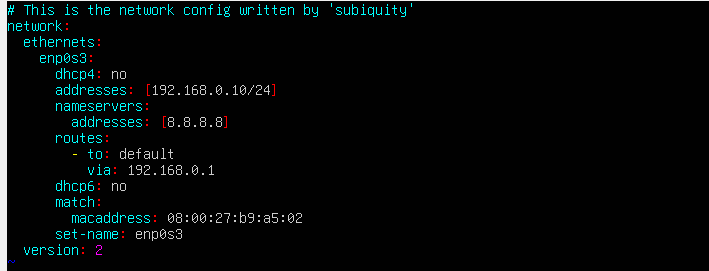
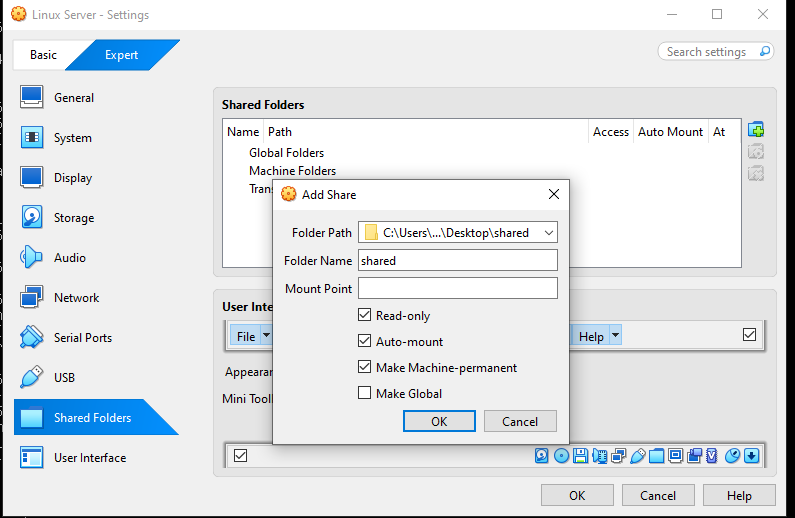

#### Static IP address
Assign static IP address to the linux server.

```splunk_user@splunk:~$ sudo vim /etc/netplan/00-installer-config.yaml```



```splunk_user@splunk:~$ sudo netplan apply ```

Notes:
8.8.8.8 is configured as a dns server so that we could download splunk from the public internet. In a real enterprise this would point to the internal DNS server (DC) and splunk would be downloaded from the internal ftp server instead. For the lab purposes i will connect all the machines to the public internet and route them to ease the download of any necessery applications and files.

Download free trial of Splunk Enterprise for linux debian:
https://www.splunk.com/en_us/download/splunk-enterprise.html

#### Mount shared directory between VM and host OS

```splunk_user@splunk:~$ sudo apt-get install virtualbox-guest-additions-iso```

Inside Virtual Box GUI go in Devices -> Shared Folders
Create abd connect shared folder from which we will get access to splunk file.



`splunk_user@splunk:~$ splunk apt-get install virtualbox-guest-utils`

Reboot the machine.

`splunk_user@splunk:~$ sudo adduser splunk_user vboxsf`

`splunk_user@splunk:~$ mkdir share`

You might need to log in again in order to group addition take effect.

`splunk_user@splunk:~$ sudo mount -t vboxsf -o uid=1000,gid=1000 shared share/`

`splunk_user@splunk:~/share$ sudo dpkg -i splunk-10.4.0-f798d4d49089-linux-amd64`

Change the user:
`splunk_user@splunk:~/share$ sudo -u splunk bash`
`splunk@splunk:~/bin$ ./splunk start`

Agree to everything :)
Administrator: splunk_user
Password: Supersecure3 (reuse password like every responsible admin)


