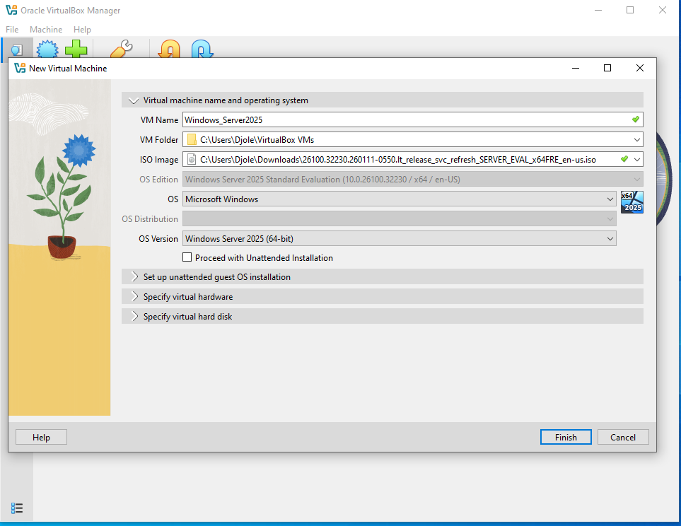
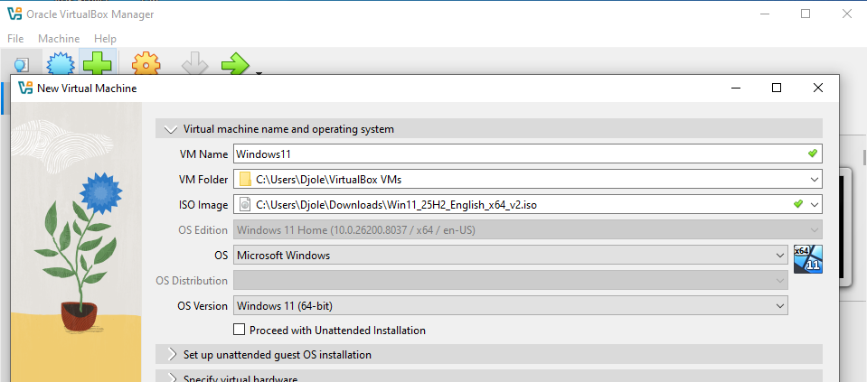
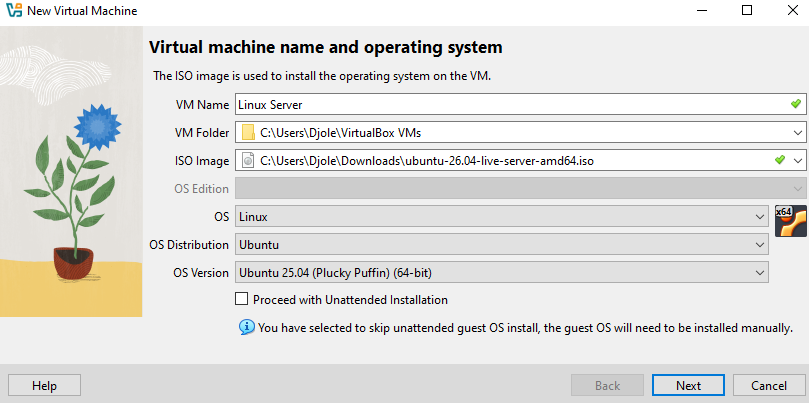
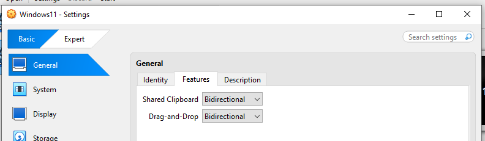
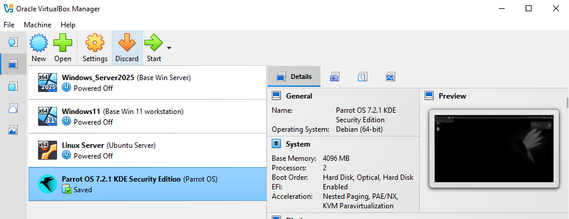

#### VirtualBox Configuration

Set up machines in VirtualBox.

Adjust resource capabilities to match your PC.
Below are the configs I used.

 Windows 11 Machines

- Base Memory: 4 GB
- CPU Cores: 2 (If you have a weaker PC, lower this to 1.)

 Windows Server

- Base Memory: 4 GB
- CPU Cores: 2

My host PC cannot comfortably handle more. If your system has additional resources available, increasing RAM and CPU allocation for the server may improve performance.

Ubuntu Server
- same

Parrot OS PC
- same

Optionally, enable clipboard and drag-and-drop integration between the guest OS and host.

Boot up devices and install OSes manually.

1. Windows 11
Click green start
Don't worry about warning pop up just click on the virtual desktop and press any key to start booting up.
When asked for product key click i don't have license url, then choose Windows 11 Pro.

Choose: Set up for work or school -> sign-in options -> Domain Join instead
username: local_admin
password: Supersecure1
For security options just fill out anything.
Turn off all the windows tracking/news stuff.

2. Windows Server 2025

Choose: Windows Server 2025 Standard Evaluation (Desktop Experience)
username: Administrator
password: Supersecure2
Choose required only for microsoft tracking stuff.

After booting of the device and finishing of all basic configs take snapshot of the machines.

Base Win 11 workstation
Base Win Server
Ubuntu Server
Parrot OS

3. Ubuntu Server

username: splunk_user
password: Supersecure3
For featured server snaps skip all, or choose something to play with later.
After installation is done click reboot.

4. Parrot OS

Since we downloaded virtual box version of OS just double click on .vbox image file and it should be imported into virtual box application.
Make sure to adjust any changes regarding the core number and RAM before installation of the os.
password: parrot

