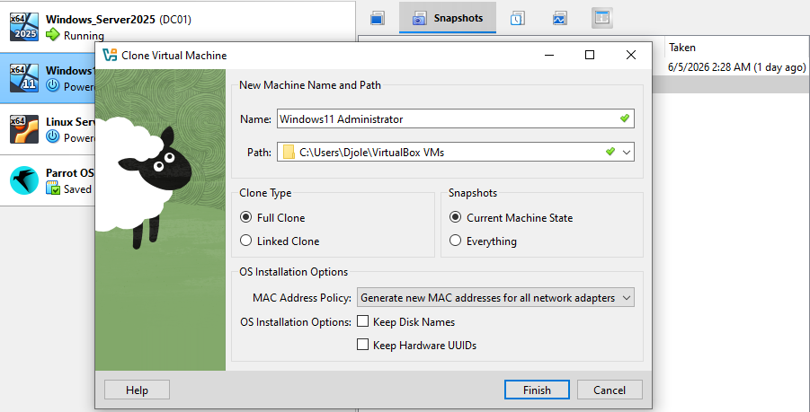

We will have two windows 11 machines:
1. Administrator PC - Will represent admin's PC from which we will do configurations on DC01 logged in as domain Admin.
2. Corp Workstation - will represent all the PCs across the various places in Corporation, for example: employee's pc's, etc...

Currently we have a fresh windows 11 OS not yet joined to a domain. After consultations with our professor Claude Van Damme we will be careful to properly synchronize cloning, snapshots and Active Domain's present-tense reality.

For the Windows 11 cloning — before you clone, the machine needs to exist and be sysprepped otherwise both clones will have identical SIDs which causes serious domain join problems.
So the order is:
1 — Install Windows 11 once from ISO — don't domain join it yet, just get a clean desktop with a local account. (Done)
2 — Take a snapshot called Win11 - Pre-clone base
3 — Clone it twice in VirtualBox — when cloning, VirtualBox will ask about MAC address policy, select Generate new MAC addresses for all network adapters. Also select Full Clone not linked clone.
4 — Rename the first clone ADMIN-PC and the second WORKSTATION01
5 — Set static IPs on both before domain joining:

ADMIN-PC: 192.168.0.30
WORKSTATION01: 192.168.0.40
DNS on both must point to DC01: 192.168.0.5

6 — Then domain join both

So here we are:



Start and log in into Windows11 Administrator VM.

```
PS C:\WINDOWS\system32> New-NetIPAddress -InterfaceAlias "Ethernet" -IPAddress 192.168.0.11 -PrefixLength 24 -DefaultGateway 192.168.0.1
PS C:\WINDOWS\system32> Set-DnsClientServerAddress -InterfaceAlias "Ethernet" -ServerAddresses 192.168.0.5
PS C:\WINDOWS\system32> Rename-Computer -NewName "ADMIN-PC" -Restart
```

Join in to domain.
```PS C:\WINDOWS\system32> Add-Computer -DomainName "massivedynamic.local" -Credential MASSIVEDYNAMIC\Administrator -Restart```

Take a snapshot -> Windows11 WKS Domain-Joined

Start and log in into Windows11 Workstation PC.

```
PS C:\WINDOWS\system32> New-NetIPAddress -InterfaceAlias "Ethernet" -IPAddress 192.168.0.12 -PrefixLength 24 -DefaultGateway 192.168.0.1
PS C:\WINDOWS\system32> Set-DnsClientServerAddress -InterfaceAlias "Ethernet" -ServerAddresses 192.168.0.5
PS C:\WINDOWS\system32> Rename-Computer -NewName "WKS1" -Restart
```

```PS C:\WINDOWS\system32> Add-Computer -DomainName "massivedynamic.local" -Credential MASSIVEDYNAMIC\Administrator -Restart```

Take a snapshot -> Windows11 Administrator Domain-Joined

Bellow we can see machines joined successfully.

```
PS C:\WINDOWS\system32> get-adcomputer -filter *

DistinguishedName : CN=DC01,OU=Domain Controllers,DC=massivedynamic,DC=local
DNSHostName       : DC01.massivedynamic.local
Enabled           : True
Name              : DC01
ObjectClass       : computer
ObjectGUID        : ae5f2708-5c9e-477d-adfd-20be08228af5
SamAccountName    : DC01$
SID               : S-1-5-21-3070078752-3506050120-2473929654-1000
UserPrincipalName :

DistinguishedName : CN=WKS1,CN=Computers,DC=massivedynamic,DC=local
DNSHostName       : WKS1.massivedynamic.local
Enabled           : True
Name              : WKS1
ObjectClass       : computer
ObjectGUID        : 030832db-2d55-4806-9692-7f5848cb9d02
SamAccountName    : WKS1$
SID               : S-1-5-21-3070078752-3506050120-2473929654-1103
UserPrincipalName :

DistinguishedName : CN=ADMIN-PC,CN=Computers,DC=massivedynamic,DC=local
DNSHostName       : ADMIN-PC.massivedynamic.local
Enabled           : True
Name              : ADMIN-PC
ObjectClass       : computer
ObjectGUID        : 242efdde-7c16-45fe-a657-abe2242fc5e1
SamAccountName    : ADMIN-PC$
SID               : S-1-5-21-3070078752-3506050120-2473929654-1104
UserPrincipalName :
```


