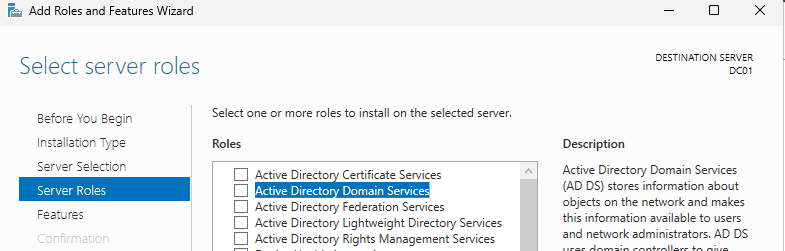
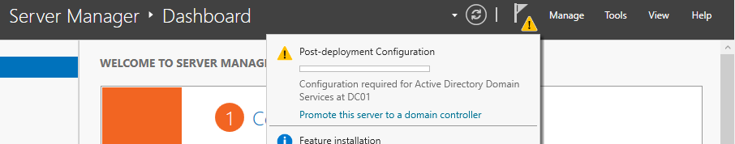
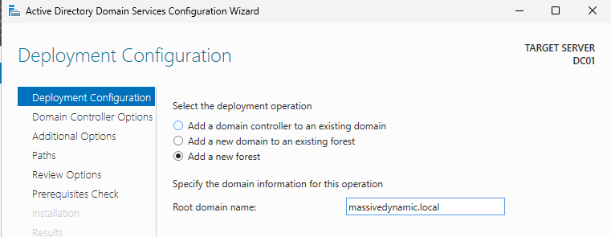

I set up creation of the domain and promotion to DC manually using Server Manager gui. While creation and configurations of the groups, OUs, etc... will be done using power shell.

Open PS (PowerShell) session as Administrator.

```
PS C:\WINDOWS\system32> New-NetIPAddress -InterfaceAlias "Ethernet" -IPAddress 192.168.0.5 -PrefixLength 24 -DefaultGateway 192.168.0.1
PS C:\WINDOWS\system32> Set-DnsClientServerAddress -InterfaceAlias "Ethernet" -ServerAddresses 192.168.0.5
PS C:\WINDOWS\system32> Rename-Computer -NewName "DC01" -Restart
```

Open Server Manager Gui.

Click on `Manage` tab -> `Add Roles and Features`.

Bellow checkboxes should be already selected by default but check them.
Role-based or feature-based installation
Select a server from the server pool --> DC01

Select ADDS:



Note: Don't select anything else. DNS Server role will be added automatically during the DC promotion wizard that comes after.

Proceed with `Next` on everything then `Install`.

Promote Windows Server to domain controller.



Create domain:



DSRM password: Supersecure4

Proceed with `Next` on everything then `Install`.


