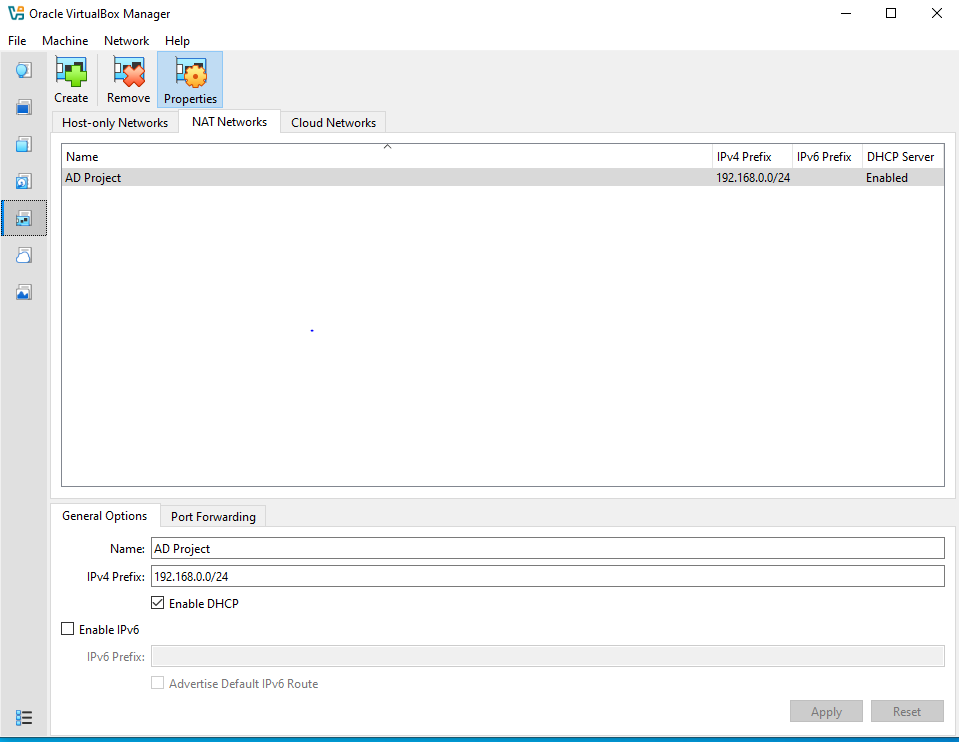
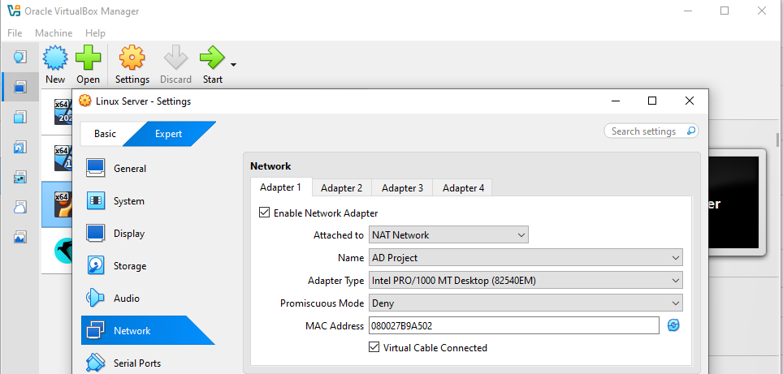

#### Preparing ISO Images:

Download Windows Server 2025 from its official website:
https://www.microsoft.com/en-us/evalcenter/evaluate-windows-server-2025
After registration you get 180 days free trial.

Download Windows 11 from its official website:
https://www.microsoft.com/en-us/software-download/windows11

Download Kali or Parrot Linux Virtual Box image:
https://parrotsec.org/download/

Download Ubuntu Server ISO image which will host Splunk:
https://ubuntu.com/download/server

#### Set up machines using virtual box
See steps in [virtual-box-machines-config.md](../VM-setup/virtual-box-machines-config.md)

#### VMs NAT Network configuration 
Create NAT Network in virtual box and assign it to the VMs.

Lesson Notes:

NAT (basic): the VM gets internet access through your host PC, like a phone sharing someone's hotspot. But VMs cannot talk to each other. Each VM is isolated. This is the default when you create a VM.

NAT Network: same internet access, but now all VMs on the same NAT Network can also talk to each other. This is what your professor set up and what you want. One shared network, internet works, VMs communicate freely.

Host-Only: VMs can talk to each other and to your physical PC, but no internet access at all. Useful for isolated labs but annoying when you need to download things.

Bridged: the VM connects directly to your physical router as if it were a real separate PC on your home network. Gets its own IP from your router. More exposure, not ideal for a lab with an attacker machine.

Internal Network: VMs talk only to each other, completely cut off from everything including your PC and internet. Maximum isolation.

Repeat on all the VMs.

#### Configuring Splunk on Linux Server

See steps in [linux-server-splunk.md](../VM-setup/linux-server-splunk.md)

#### Creation of AD domain and promoting Windows server 2025 to Domain Controller

See steps in [windows-server-DC.md](../VM-setup/windows-server-DC.md)

#### Configuring Windows 11 VMs
Clone base Windows 11 installation into two machines (ADMIN-PC and WKS1), configure static IPs with DNS pointing to DC01, and join both to the domain.

See steps in [windows-11-pc.md](../VM-setup/windows-11-pc.md)

#### Complete creation and configuration of Active Domain

See steps in [Active Directory](../Active-Directory/steps-to-follow.md)

#### Configuring Splunk and Sysmon on Windows 11 workstation TODO

Now configure splunk and sysmon on Windows 11 PC and Windows Server (Domain Controller).

See steps in [windows-11-pc.md](../VM-setup/windows-11-pc.md)

#### Configuring Parrot attacking machine TODO

Configuration and guided steps through brute-forcing domain admin's password with hydra. Running bloodhound to map out the domain. Copying ntds.dit and cracking domain hashes using hashcat.
See steps in [parrot-attacker.md](../VM-setup/parrot-attacker.md) 

Analyzing and commenting detected events in splunk.
Example of using AtomicRed to test and strengthen the siem telemetry logs.

